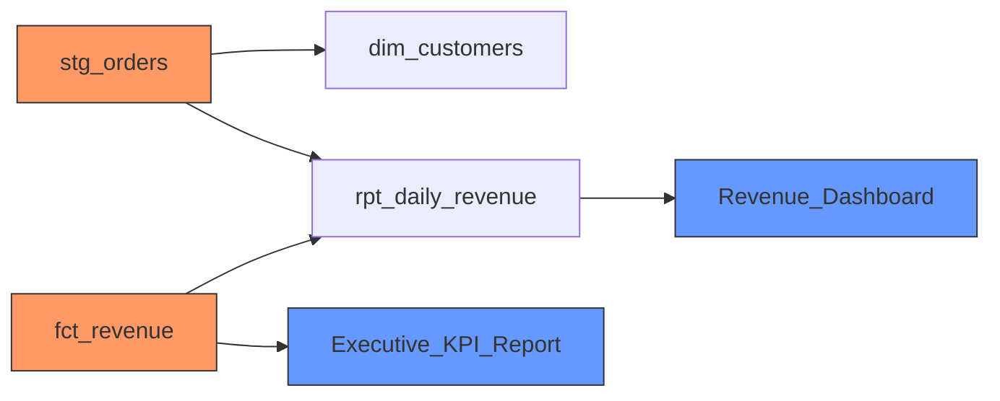

<p align="center">
  
</p>

<h1 align="center">Altimate Code Actions</h1>

<p align="center">
  <strong>AI-powered SQL &amp; dbt code review for every pull request.</strong>
</p>

<p align="center">
  <a href="https://github.com/AltimateAI/altimate-code-actions/releases"></a>
  <a href="https://github.com/AltimateAI/altimate-code-actions/actions/workflows/ci.yml"></a>
  <a href="https://github.com/marketplace/actions/altimate-code-review"></a>
  <a href="LICENSE"></a>
</p>

---

Altimate Code Actions brings production-grade SQL analysis, dbt impact assessment, query cost estimation, and PII detection directly into your GitHub pull request workflow. Every SQL change gets reviewed automatically before it merges.

## What It Does

| | Capability | Description |
|---|---|---|
| :zap: | **Executive Summary** | One-line scope, impact, cost, and severity overview at the top of every review |
| :mag: | **SQL Quality Analysis** | Detects anti-patterns, performance issues, and correctness bugs across 19 rule categories |
| :deciduous_tree: | **dbt Impact Analysis** | Maps changed models to downstream dependencies, exposures, and tests in your dbt DAG |
| :world_map: | **Mermaid DAG Visualization** | Colored dependency graph rendered inline using GitHub-native Mermaid |
| :moneybag: | **Cost Estimation** | Estimates query cost deltas so you catch expensive changes before they hit production |
| :shield: | **PII Detection** | Identifies personally identifiable information across 15 categories to prevent data leaks |
| :speech_balloon: | **Inline Comments** | Critical issues posted directly on diff lines for faster triage |
| :video_game: | **Interactive Commands** | `@altimate review`, `@altimate impact`, `@altimate cost`, `@altimate help` in PR comments |

## Quick Start

### Zero-Config (Static Analysis Only)

No API key needed. Catches SQL anti-patterns, schema breaking changes, and PII exposure.

```yaml
- uses: AltimateAI/altimate-code-actions@v0
  with:
    mode: static
```

### With AI Review

Add an LLM for deeper analysis:

```yaml
- uses: AltimateAI/altimate-code-actions@v0
  with:
    model: anthropic/claude-haiku-4-5-20251001
  env:
    ANTHROPIC_API_KEY: ${{ secrets.ANTHROPIC_API_KEY }}
```

### Full Workflow Example

Add this workflow to your repository at `.github/workflows/altimate-review.yml`:

```yaml
name: Altimate Code Review
on:
  pull_request:
    types: [opened, synchronize]

permissions:
  pull-requests: write
  contents: read

jobs:
  review:
    runs-on: ubuntu-latest
    steps:
      - uses: actions/checkout@v4
      - uses: AltimateAI/altimate-code-actions@v0
        with:
          mode: static
        env:
          GITHUB_TOKEN: ${{ secrets.GITHUB_TOKEN }}
```

That is it. Open a PR that touches `.sql` files and Altimate will post a review comment.

## Example PR Comment

When Altimate reviews your pull request, it posts a compact, structured comment like this:

```
## Altimate Code Review

**3 files · 5 issues (1 error) · impact 42/100 · +$6.30/mo**

| File | Line | Rule | Message | Fix |
|------|------|------|---------|-----|
| stg_orders.sql | 14 | no-select-star | Avoid SELECT * | Enumerate columns explicitly |

<details><summary>:warning: Warnings (2)</summary>

| File | Line | Rule | Message | Fix |
|------|------|------|---------|-----|
| fct_revenue.sql | 27 | missing-where | DELETE without WHERE | Add a WHERE clause |
| fct_revenue.sql | 53 | implicit-join | Comma join detected | Use explicit JOIN syntax |

</details>

<details><summary>:blue_circle: Info (2)</summary>

| File | Line | Rule | Message | Fix |
|------|------|------|---------|-----|
| stg_users.sql | 8 | pii-detected | Column `email` may contain PII | Mask or exclude from SELECT |
| stg_users.sql | 9 | pii-detected | Column `phone` may contain PII | Mask or exclude from SELECT |

</details>

### Blast Radius



7 tests cover modified or downstream models

### Cost Estimation

| Model | Before | After | Delta | Root Cause |
|-------|--------|-------|-------|------------|
| fct_revenue | $12.40/mo | $18.70/mo | +$6.30/mo | Added full table scan |

<sub><a href="https://github.com/AltimateAI/altimate-code-actions">Altimate Code</a> · <a href="https://github.com/AltimateAI/altimate-code-actions/blob/main/docs/configuration.md">Docs</a> · 19 rules</sub>
```

When `comment_mode: both` is configured, critical issues are also posted as inline review comments directly on the affected diff lines.

## Features

### Always-On (Static Analysis)

These checks run on every PR without any external credentials:

- **SELECT * detection** -- Flag wildcard selects that break downstream consumers
- **Missing WHERE clauses** -- Catch unfiltered UPDATE and DELETE statements
- **Implicit joins** -- Convert comma-separated joins to explicit JOIN syntax
- **Unused CTEs** -- Find common table expressions that are defined but never referenced
- **Ambiguous column references** -- Detect columns that could resolve to multiple tables
- **Duplicate column aliases** -- Catch conflicting column names in SELECT lists
- **ORDER BY in subqueries** -- Remove unnecessary sorting inside subqueries
- **UNION vs UNION ALL** -- Suggest UNION ALL when deduplication is not required
- **Cartesian joins** -- Warn on joins missing a join condition
- **Schema qualification** -- Require fully qualified table references

### dbt-Aware

Enable with `impact_analysis: true` when your repository contains a dbt project:

- **DAG impact mapping** -- Trace changes through the full dependency graph
- **Downstream model enumeration** -- List every model affected by the change
- **Exposure alerting** -- Flag when dashboards and reports are impacted
- **Test coverage check** -- Verify that affected models have test coverage
- **Impact scoring** -- Aggregate risk score from 0 to 100
- **Schema breaking change detection** -- Detect column renames and removals that break downstream

### Cost Intelligence

Enable with `cost_estimation: true` and warehouse credentials:

- **Before/after cost comparison** -- Estimate monthly cost before and after the change
- **Per-model cost deltas** -- Pinpoint which models drive cost increases
- **Aggregate cost summary** -- Total cost impact across the entire PR

### PII Detection

Enable with `pii_check: true`:

- Detects 15 PII categories: email, phone, SSN, credit card, IP address, date of birth, name, address, passport, driver license, national ID, bank account, health records, biometric data, geolocation

### Interactive Commands

When interactive mode is enabled, developers can trigger specific analyses by commenting on a PR:

| Command | Description |
|---------|-------------|
| `@altimate review` | Run full SQL quality review on the PR |
| `@altimate impact` | Run dbt DAG impact analysis only |
| `@altimate cost` | Run cost estimation only |
| `@altimate help` | Show available commands and configuration |

Configure trigger phrases with the `mentions` input (default: `@altimate,/altimate,/oc`).

## What Altimate Adds Beyond dbt Cloud

| Feature | dbt Cloud CI | Altimate Code |
|---------|-------------|---------------|
| Slim CI (build changed models) | Yes | No (use dbt Cloud for this) |
| SQL anti-pattern detection | No | Yes (19 rules) |
| Impact blast radius in PR | Limited | Yes (full DAG visualization) |
| Query cost estimation | No | Yes (Snowflake, BigQuery) |
| PII detection | No | Yes (15 categories) |
| Schema breaking changes | No | Yes |
| AI-powered review | No | Yes |

Altimate Code Actions and dbt Cloud CI are complementary. Use dbt Cloud for build/test orchestration and slim CI, and Altimate for deep SQL quality analysis, cost estimation, and PII detection on every pull request.

## Configuration

### Inputs

| Input | Type | Default | Description |
|-------|------|---------|-------------|
| `model` | string | `""` | AI model for analysis (e.g., `anthropic/claude-haiku-4-5-20251001`). Required for `ai` and `full` modes. |
| `mode` | string | `full` | Review mode: `static`, `ai`, or `full` |
| `sql_review` | boolean | `true` | Enable SQL quality analysis |
| `impact_analysis` | boolean | `true` | Enable dbt DAG impact analysis |
| `cost_estimation` | boolean | `false` | Enable query cost estimation |
| `pii_check` | boolean | `true` | Enable PII detection |
| `interactive` | boolean | `true` | Enable interactive mode (`/altimate` mentions in PR comments) |
| `mentions` | string | `/altimate,/oc` | Trigger phrases for interactive mode (comma-separated) |
| `dbt_project_dir` | string | *(auto-detect)* | Path to dbt project root |
| `dbt_version` | string | *(auto-detect)* | dbt version: `1.7`, `1.8`, or `1.9` |
| `manifest_path` | string | *(auto-detect)* | Path to dbt `manifest.json` |
| `warehouse_type` | string | | Warehouse type: `snowflake`, `bigquery`, `postgres`, `databricks`, `redshift` |
| `warehouse_connection` | string | | JSON warehouse connection config (alternative to env vars) |
| `max_files` | number | `50` | Maximum number of SQL files to analyze per PR |
| `severity_threshold` | string | `warning` | Minimum severity to include in review: `info`, `warning`, `error`, `critical` |
| `comment_mode` | string | `single` | Comment style: `single` (one summary comment), `inline` (per-line comments), `both` |
| `fail_on` | string | `none` | Fail the action when issues at this severity or above are found: `none`, `error`, `critical` |

### Outputs

| Output | Description |
|--------|-------------|
| `issues_found` | Total number of issues found |
| `impact_score` | dbt impact score (0-100), if impact analysis was enabled |
| `estimated_cost_delta` | Estimated monthly cost delta in USD, if cost estimation was enabled |
| `comment_url` | URL of the posted PR comment |
| `report_json` | Full review report as a JSON string |

### Environment Variables

| Variable | Required | Description |
|----------|----------|-------------|
| `GITHUB_TOKEN` | Yes | GitHub token for PR comments and file access (provided automatically) |
| `ANTHROPIC_API_KEY` | For `ai`/`full` mode | API key for Claude models |
| `OPENAI_API_KEY` | For `ai`/`full` mode | API key for OpenAI models (alternative to Anthropic) |
| `SNOWFLAKE_ACCOUNT` | For Snowflake cost estimation | Snowflake account identifier |
| `SNOWFLAKE_USER` | For Snowflake cost estimation | Snowflake username |
| `SNOWFLAKE_PASSWORD` | For Snowflake cost estimation | Snowflake password |
| `BIGQUERY_CREDENTIALS` | For BigQuery cost estimation | GCP service account JSON |

## Workflow Examples

### Basic SQL Review

Static analysis only, no API keys required:

```yaml
- uses: AltimateAI/altimate-code-actions@v0
  with:
    mode: static
  env:
    GITHUB_TOKEN: ${{ secrets.GITHUB_TOKEN }}
```

### AI-Powered Review

Use Claude for deeper analysis:

```yaml
- uses: AltimateAI/altimate-code-actions@v0
  with:
    mode: ai
    model: anthropic/claude-haiku-4-5-20251001
  env:
    GITHUB_TOKEN: ${{ secrets.GITHUB_TOKEN }}
    ANTHROPIC_API_KEY: ${{ secrets.ANTHROPIC_API_KEY }}
```

### dbt Project with Impact Analysis

```yaml
- uses: AltimateAI/altimate-code-actions@v0
  with:
    mode: full
    model: anthropic/claude-haiku-4-5-20251001
    impact_analysis: true
    dbt_project_dir: ./dbt
  env:
    GITHUB_TOKEN: ${{ secrets.GITHUB_TOKEN }}
    ANTHROPIC_API_KEY: ${{ secrets.ANTHROPIC_API_KEY }}
```

### Full Review with Cost Estimation

```yaml
- uses: AltimateAI/altimate-code-actions@v0
  with:
    mode: full
    model: anthropic/claude-sonnet-4-20250514
    impact_analysis: true
    cost_estimation: true
    pii_check: true
    warehouse_type: snowflake
  env:
    GITHUB_TOKEN: ${{ secrets.GITHUB_TOKEN }}
    ANTHROPIC_API_KEY: ${{ secrets.ANTHROPIC_API_KEY }}
    SNOWFLAKE_ACCOUNT: ${{ secrets.SNOWFLAKE_ACCOUNT }}
    SNOWFLAKE_USER: ${{ secrets.SNOWFLAKE_USER }}
    SNOWFLAKE_PASSWORD: ${{ secrets.SNOWFLAKE_PASSWORD }}
```

### Interactive Mode

Let developers ask for reviews by commenting `@altimate` on a PR:

```yaml
name: Altimate Interactive
on:
  issue_comment:
    types: [created]

permissions:
  pull-requests: write
  contents: read

jobs:
  review:
    if: contains(github.event.comment.body, '@altimate')
    runs-on: ubuntu-latest
    steps:
      - uses: actions/checkout@v4
      - uses: AltimateAI/altimate-code-actions@v0
        with:
          interactive: true
          mentions: "@altimate,@alt"
          mode: full
          model: anthropic/claude-sonnet-4-20250514
        env:
          GITHUB_TOKEN: ${{ secrets.GITHUB_TOKEN }}
          ANTHROPIC_API_KEY: ${{ secrets.ANTHROPIC_API_KEY }}
```

### Custom Severity Threshold

Only surface errors and critical issues, and fail the CI check:

```yaml
- uses: AltimateAI/altimate-code-actions@v0
  with:
    mode: static
    severity_threshold: error
    fail_on: error
  env:
    GITHUB_TOKEN: ${{ secrets.GITHUB_TOKEN }}
```

### Inline Comments

Post review comments directly on the changed lines:

```yaml
- uses: AltimateAI/altimate-code-actions@v0
  with:
    mode: static
    comment_mode: both
  env:
    GITHUB_TOKEN: ${{ secrets.GITHUB_TOKEN }}
```

## Supported Warehouses

| Warehouse | SQL Analysis | Cost Estimation | Impact Analysis |
|-----------|:---:|:---:|:---:|
| Snowflake | Yes | Yes | Yes |
| BigQuery | Yes | Yes | Yes |
| PostgreSQL | Yes | -- | Yes |
| Databricks | Yes | -- | Yes |
| Redshift | Yes | -- | Yes |
| MySQL | Yes | -- | -- |
| SQL Server | Yes | -- | -- |
| DuckDB | Yes | -- | Yes |

## dbt Version Support

| dbt Core Version | Status | Notes |
|------------------|--------|-------|
| 1.7.x | Supported | Minimum supported version |
| 1.8.x | Supported | |
| 1.9.x | Supported | Latest supported version |

E2E tests run against all three versions on Python 3.10, 3.11, and 3.12.

## How It Works

Altimate Code Actions is a GitHub Action that runs the [altimate-code](https://github.com/AltimateAI/altimate-code) CLI inside your CI pipeline. When a pull request is opened or updated, the action:

1. **Collects context** -- Fetches the list of changed files from the GitHub API, filters for SQL and dbt-related files, and parses the unified diff to extract added and modified code.

2. **Runs analysis** -- Passes the changed SQL through the `altimate-code` CLI, which performs static analysis (anti-pattern detection, PII scanning) and optionally AI-powered review (using Claude or GPT models). If a dbt project is detected and impact analysis is enabled, it parses the dbt manifest to trace downstream dependencies.

3. **Estimates costs** -- When cost estimation is enabled with warehouse credentials, the CLI runs `EXPLAIN` or equivalent queries against your warehouse to estimate the before/after cost of modified queries.

4. **Reports results** -- Formats the findings into a structured PR comment (or inline review comments) and posts it via the GitHub API. If a previous Altimate comment exists on the PR, it is updated in place rather than creating a duplicate.

The action uses a sticky comment pattern (identified by an HTML marker) so that re-running the workflow on new commits updates the existing review rather than flooding the PR with repeated comments.

All analysis runs inside the GitHub Actions runner. Your code is never sent to external servers beyond the AI model API calls (when using `ai` or `full` mode). Warehouse credentials are used only for cost estimation queries and are never logged.

## Contributing

Contributions are welcome. See [CONTRIBUTING.md](CONTRIBUTING.md) for development setup, testing instructions, and the PR process.

## License

[Apache License 2.0](LICENSE)
