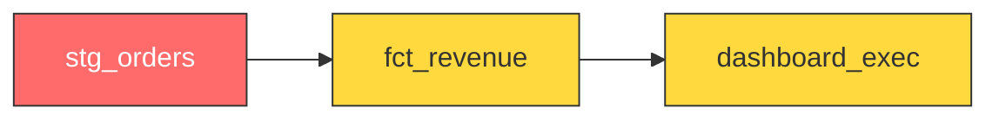

# PR Comment v0.3 Creative Ideas

Research from 11 tools (Vercel, Codecov, CodSpeed, Socket.dev, Chromatic, Datafold, Atlan, Sifflet, CodeRabbit, Graphite, Next.js Bot).

## The 5 Ideas

### 1. Mermaid DAG Blast Radius (GitHub renders natively)

### 2. Before/After Data Impact Table
| Metric | Before | After | Delta |
|--------|--------|-------|-------|
| Row count | 1,247,832 | 1,247,891 | +59 (+0.005%) |
| Null rate (`email`) | 2.3% | 0.0% | -2.3% |

### 3. ASCII Health Sparklines
| Model | Test Pass Rate | Cost |
|-------|---------------|------|
| `fct_revenue` | `█████████▇` 98% | `▂▂▃▃▃▃▂▂▂█` :warning: |

### 4. Semantic Contract Diffs (diff block with inline comments)
### 5. Executive One-Line Summary
`3 models` modified | `7 downstream` | `0 contracts` broken | `+$0.42/day` | `98%` tests

## Key Principle
> The best tools are opinionated about information density. Verdict-first, details behind `
`.
